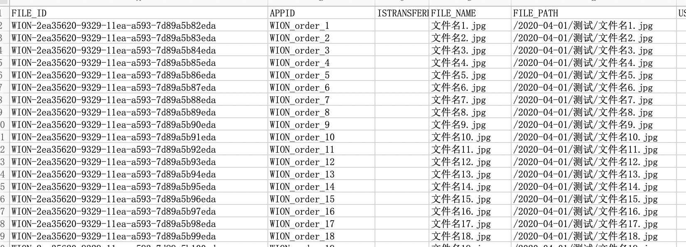

##  🖊 背景
* 项目需要将一批历史发票数据迁移服务器
* 新服务器需要建立一个表做对应关系，需要输入文件的路径，文件名，生成的UUID，APPID作为新服务地址的对应关系来映射图片
* 每100000条一批数据一个ID

## 🤔 思考
* 先把数据转存为EXCEL
    * 递归文件夹，取出文件夹和名称和地址
    * 使用UUID生成随机ID
    * 使用node-xlsx 生成EXCEL文件
* 然后导入数据库表

* 大致的EXCEL生成样例如下

